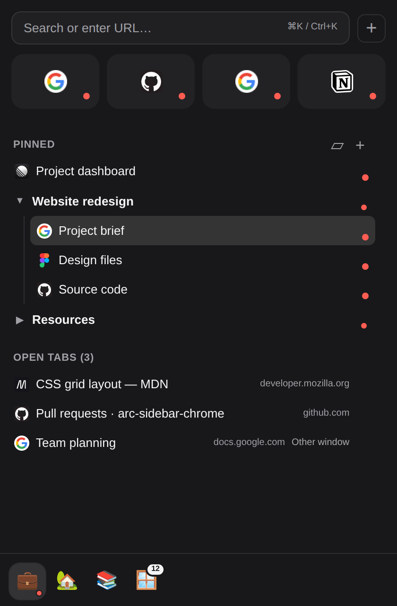
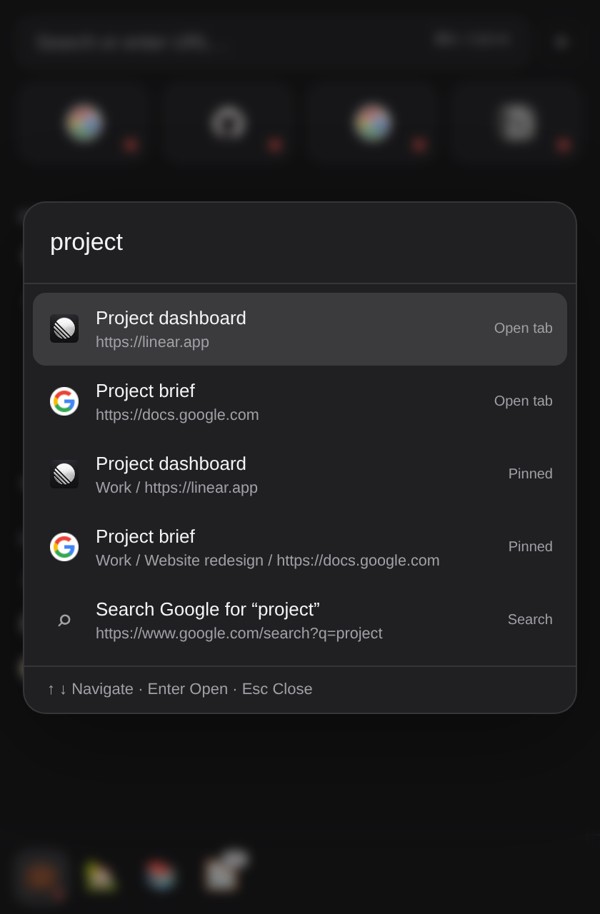
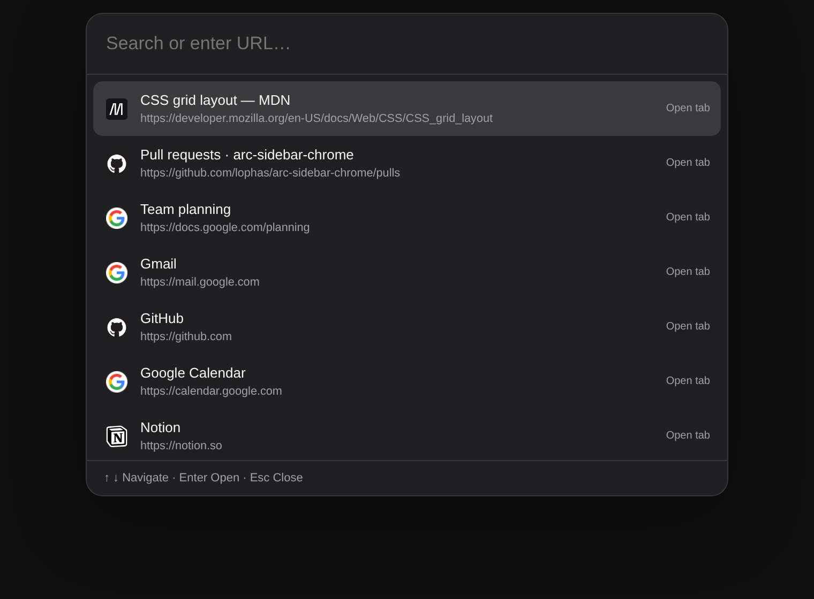

# Arc Sidebar for Chrome

## Mission

Bring Arc Browser’s organized, sidebar-first browsing experience to Google Chrome. Keep your everyday sites close, arrange your work into Spaces and folders, and open only the tabs you need.

Your saved links stay in the sidebar when their browser tabs close. Click a saved item to open it or return to its existing tab, including after navigating away from the saved URL.

> **Disclaimer:** Arc Sidebar for Chrome is an independent extension developed entirely from scratch. It is not affiliated with, endorsed by or sponsored by The Browser Company or Arc Browser.

## Main features

- **Spaces** — separate projects and activities, with their own pinned links, folders and open tabs.
- **Global Favorites** — keep frequently used sites accessible from every Space.
- **Persistent pinned links** — save pages without keeping their tabs open; return to the same live tab when you need it.
- **Search popup** — press **⌘K / Ctrl+K** to find recent tabs, Favorites, pinned links, folders and Spaces, open a URL or search Google.
- **Folders and drag-and-drop** — organize links, choose their exact order, and move them between folders and Spaces. Hold a dragged item near the top or bottom of the pinned list to scroll.
- **Open tabs overview** — browse the current window’s tabs by Chrome group, close a whole group, or close all tabs with confirmation.
- **Open tabs within each Space** — see the Space’s additional browser tabs below its pinned links and drag them into the pinned list to save them.
- **Matching Chrome groups** — Favorites first, then Space groups in sidebar order, with pinned tabs ordered by the sidebar hierarchy.
- **Focused tab bar** — tab or window focus changes expand the active group and collapse the others; manual group changes remain until focus changes again.
- **Two sidebar modes** — an autohide overlay at the same edge as Chrome’s side panel or Chrome’s native Side Panel.
- **Live indicators and bulk close** — see what is open and close a Favorite, pinned tab, folder or an entire Space’s open tabs.
- **Personalized appearance** — website favicons, uploaded icons, searchable Space emojis and adjustable Favorite tile sizes.
- **Remembered layout** — return to your previous scroll position in each Space and the Open tabs view.
- **Seamless Arc Browser migration** — import all your Spaces, Favorites, pinned links and folders from Arc Browser in one step, with Space emojis and website icons, keeping your existing organization ready to use in Chrome.
- **Chrome Sync and backups** — keep your sidebar organization available across computers and save or restore it whenever you need.
- **Pin from any webpage** — save the current page or a link to Favorites or any Space through Chrome’s right-click menu.

## Screenshots

Example workspace with Favorites, folders, pinned links and additional Space tabs.

| Sidebar | Search inside the sidebar |
| --- | --- |
|  |  |

## Documentation

### Installation and updates

1. Download the extension ZIP from [GitHub Releases](https://github.com/lophas/arc-sidebar-chrome/releases).
2. Extract it to a permanent folder.
3. Open `chrome://extensions` and enable **Developer mode**.
4. Click **Load unpacked** and select the folder containing `manifest.json`.
5. Pin the extension’s toolbar button for quick access.

To use the latest changes on `main`, download the repository through **Code → Download ZIP**, extract it and load the folder containing `manifest.json` in the same way.

To update an existing installation, replace its files with the new contents, then click **Reload** on the extension’s card at `chrome://extensions`. Keep the installation folder in place while using the extension.

### Getting started

1. Open the sidebar using the extension’s toolbar button, or move the pointer to the edge selected for Chrome’s side panel of a webpage in Autohide mode.
2. Create a Space for a project or activity.
3. Add pinned links and folders to that Space.
4. Add your everyday sites to Favorites using the **+** button beside the search control.
5. Use **⌘K / Ctrl+K** to jump between pages and Spaces.

The sidebar keeps search and Favorites at the top, the Space switcher at the bottom, and the current Space’s contents in the scrollable middle area.

### Search popup



Press **Command+K** on macOS or **Ctrl+K** on Windows/Linux to open search, including when the sidebar is closed. The sidebar’s **Search or enter URL** control opens the same search inside the sidebar.

With an empty query, search shows recently accessed open tabs. Type to find:

- open tabs across Chrome windows;
- Favorites and pinned links;
- folders and Spaces.

Results show website favicons. Search matches all entered words and ignores differences in accents. Open-tab results include webpages and file URLs.

Enter a URL to open it, or choose a Google search. Use **↑ / ↓** to select a result, **Enter** to open it, and **Escape** to dismiss search.

Selecting a saved link returns to its existing live tab when available. Selecting a pinned link or its bound open tab also switches the sidebar to the correct Space and expands its parent folders. Folder and Space results navigate to the selected location; navigation from the standalone popup opens the native sidebar.

Change the shortcut at `chrome://extensions/shortcuts`.

### Spaces

Use Spaces to separate different projects, interests or activities. Each Space contains its own pinned links, folders and additional open tabs.

- Select a Space from the switcher at the bottom of the sidebar.
- Drag Spaces to change their order.
- Right-click a Space to edit its name and icon or choose **Close open tabs**.
- A red indicator shows when the Space has open pinned tabs.

**Close open tabs** closes every tab in all Chrome groups associated with that Space, including additional non-pinned tabs and tabs in other windows. The menu shows the number of tabs that will close. Saved links and folders remain available.

### Favorites

Favorites are shared across all Spaces. Use them for sites you visit throughout the day.

- Use the **+** button beside search to add a Favorite.
- Click a Favorite to open it or focus its existing tab.
- Click its red live indicator to close the tab while keeping the Favorite.
- Drag Favorites to change their order. Drag a pinned link from a Space or folder into Favorites to make it available everywhere, keeping its open tab and custom icon. Drop it on **+ Favorite** when the Favorites list is empty. Drag a Favorite back into a Space to place it between pinned links or folders, or inside a folder. Its open tab and custom icon follow the move. Links opened in a new tab from a Favorite go into the currently selected Space’s Chrome group.
- Edit a Favorite to change its title, URL or icon.

The Favorite grid adapts to the sidebar’s width. Choose a tile size of **80%, 90%, 100%, 110% or 120%** in the extension’s options.

### Pinned links

Pinned links remain in their Space until you remove them, whether their browser tabs are open or closed.

Click a pinned link to open it or return to its existing tab. A red indicator marks an open tab; click the indicator to close it and keep the saved link. The next opening uses the saved URL.

Right-click a pinned link to edit its title, URL or icon. Drag links to place them:

- before or after another link;
- inside a folder;
- between folders or back at the Space’s root;
- in another Space by dropping onto that Space.

### Folders

Folders organize pinned links within a Space. Click a folder heading to expand or collapse it.

Use the folder editor to rename it or move the complete folder to another Space. Drag folders to reorder them within their current Space. Removing a folder keeps its links.

A red indicator shows when a folder contains open pinned tabs. Hover over it to reveal **×** and **Close**, then click to close those tabs together while keeping its saved contents. The same control is available on live links, Favorites and Chrome group rows.

### Open tabs

**Within a Space:** additional tabs in its Chrome groups appear below the pinned links. These rows show favicons, open the tab when clicked and close it with **×**. Tabs in another window are marked **Other window**.

To save an open tab, drag it into the pinned list at the desired position. You can drop it between links, inside a folder or into an empty Space. The same browser tab becomes the pinned item’s live tab. You can also pin it through its right-click menu.

**Open tabs view:** the dedicated **Open tabs** Space shows all live tabs in the current Chrome window. Tabs are organized by Chrome group, in tab-bar order, with ungrouped tabs listed together. Hover over the red indicator and click **×** beside a group name to close all its tabs. Right-click the **Open tabs** Space to close all tabs in the current Chrome window after confirmation. Saved Favorites, pinned links and folders remain available. Chrome’s own pinned tabs appear first in a blue, read-only section with a **Pinned tab** tooltip. They have no live indicator or actions, and are excluded from all sidebar close operations.

### Chrome tab groups

Favorites use a **Favorites** Chrome group. Each Space uses its own Chrome group in every window where its tabs are open.

The groups follow the sidebar: **Favorites first**, then Spaces in their configured order. Newly opened groups take their place in that order. Reordering Spaces updates the group order too.

When tab or window focus changes, the active tab’s Space or Favorites group expands and the other managed groups in that window collapse. If the active tab is outside these groups, they all collapse. Their tabs stay open.

Between focus changes, you can freely expand or collapse groups yourself. Your manual layout stays in place until the next focus change in that window.

Within a group, pinned tabs follow the sidebar’s folder and link order. Additional tabs opened during your work remain part of the Space and appear below its pinned links in the sidebar.

### Sidebar modes and layout

Choose **Extension options → Autohide timeout**.

**Autohide overlay** appears when the pointer reaches the same edge as Chrome’s side panel of a webpage and closes after the pointer leaves. Select a timeout from **500 to 1100 ms** in 100 ms steps; **800 ms** is the default. Select **0 · Disabled (fixed)** to use the fixed Chrome side panel. Both Autohide and Fixed follow **Chrome Settings → Appearance → Side panel**. Each open tab picks up changes when you next focus it. It floats over the page. Resize it to suit your workflow; its width is remembered. While an editor is open, the sidebar stays visible until you save or cancel.

**Fixed · Chrome side panel** opens through the extension’s toolbar button and sits alongside the page. Choose its left or right position in **Chrome Settings → Appearance → Side panel**.

Each Space and the Open tabs view remember their own scroll position. Returning to a view brings you back to where you left it.

### Icons and appearance

Favorites and pinned links can use their website favicon or an uploaded **SVG, PNG, WebP or JPEG** image. Upload an image by clicking the upload area or dragging a file onto it.

Spaces support uploaded images, pasted emojis and a searchable emoji picker. Search by name or keyword, country name/code for flags, or familiar aliases such as `:)`, `:D` and `<3`.

Custom icons are included in backups and Chrome Sync.

### Pin a page or link

Right-click a webpage or link and choose **Pin to Arc Sidebar**, then select the destination Space.

Pinning the current page keeps its existing browser tab connected to the saved item.

### Import from Arc Browser

Seamlessly move your existing Arc Browser organization to Chrome in one import: all your Spaces, Favorites, pinned links and folders, with Space emojis and website favicons.

Open the extension’s options and import Arc Browser’s `StorableSidebar.json`. Import replaces the current sidebar contents, so download a backup first if you want to keep them.

Typical file locations:

**macOS**

```text
~/Library/Application Support/Arc/StorableSidebar.json
```

**Windows**

```text
%LOCALAPPDATA%\Packages\TheBrowserCompany.Arc_*\LocalCache\Local\Arc\StorableSidebar.json
```

### Chrome Sync

Enable Chrome Sync in the extension’s options to synchronize Spaces, Favorites, folders, pinned links, their order and custom icons across computers.

Each computer keeps its own open tabs, current Space, collapsed folders, scroll positions, sidebar mode, overlay width and Favorite tile size.

If different computers change the sidebar, the most recently updated sidebar becomes the synchronized version.

### Backup, restore and reset

The extension’s options provide:

- **Download backup** — save your Spaces, Favorites, folders, pinned links, custom icons, autohide timeout, Favorite button size and sidebar width as a JSON file.
- **Restore backup** — replace the current sidebar contents and restore the appearance settings included in the backup. Older backups keep your current timeout, Favorite size and sidebar width.
- **Reset all extension data** — clear the extension’s saved organization and settings, including synchronized data. Your Chrome tabs stay open.

Download a backup before importing, restoring or resetting if you want to preserve your current setup.

## License

See [LICENSE](LICENSE).
